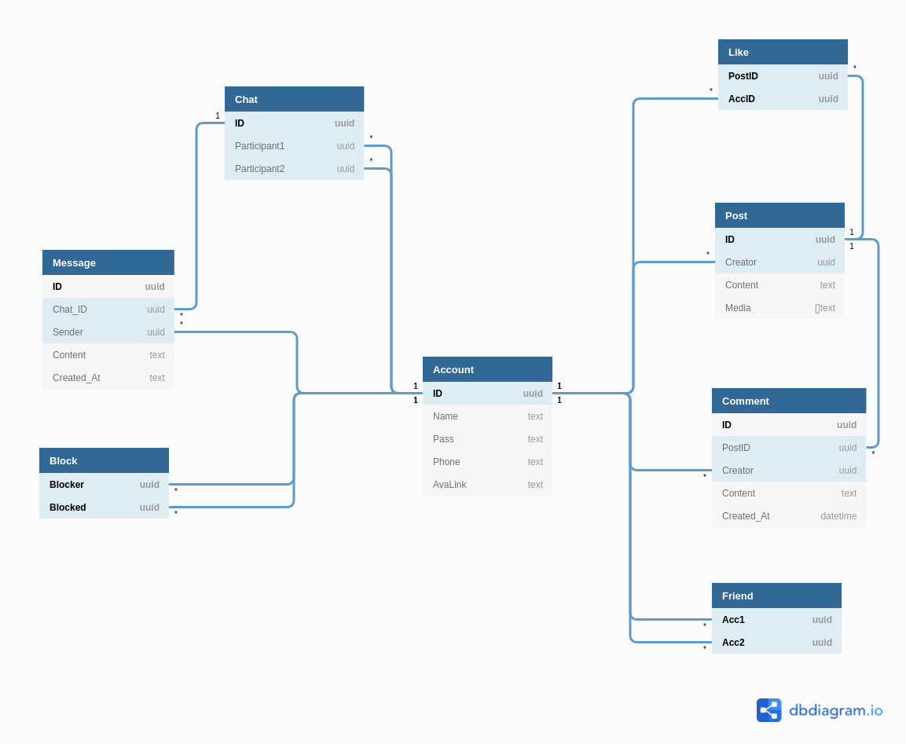
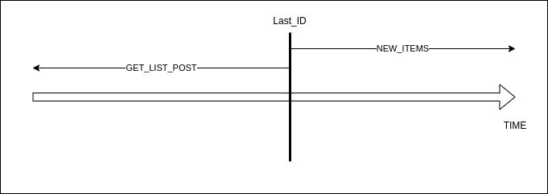

# Zola ~= Zalo

- [Zola ~= Zalo](#zola--zalo)
  - [Documents](#documents)
    - [Requirements](#requirements)
    - [Database](#database)
    - [Services](#services)
    - [Relations](#relations)
    - [APIs](#apis)
      - [User](#user)
      - [Post](#post)
      - [Chat](#chat)
      - [More APIs](#more-apis)
      - [Admin APIs](#admin-apis)

## Documents

### Requirements
- [GOOGLE DRIVE](https://drive.google.com/drive/folders/1ii_FZnXnlrzpcdi5AwqHDAD82lV-0S8T?usp=sharing)
- Timestamp: Seconds from 01/01/1970 (Unix)
### Database


### Services
1. Lạc Long Quân - Manage users, posts
   1. [Postman](docs/Zola.postman_collection.json)
2. Âu Cơ - Manage chats, messages

### Relations
- Users can only **block diary** from each other if they were a friend
- **Block message** means block everything, including
  - Remove the friend relationship
  - Remove all likes, comments
- Only friends can see each other posts, comments, likes

### APIs
#### User
- [x] [signup](https://github.com/thanhpp/zola/commit/1a1bef3d247af842f8c1a16e8a4abea2c158e953)
- [x] [login](https://github.com/thanhpp/zola/issues/1)
- [x] [logout](https://github.com/thanhpp/zola/issues/3)
- [x] [set_request_friend](https://github.com/thanhpp/zola/issues/21)
- [x] [get_requested_friend](https://github.com/thanhpp/zola/issues/63)
- [x] [set_accept_friend](https://github.com/thanhpp/zola/issues/21)
- [x] [get_user_friends](https://github.com/thanhpp/zola/issues/65)
- [x] [change_password](https://github.com/thanhpp/zola/issues/26)
- [x] [set_block_user](https://github.com/thanhpp/zola/issues/19)
- [x] [set_block_diary](https://github.com/thanhpp/zola/issues/67)
- [x] [set_user_info](https://github.com/thanhpp/zola/issues/58)
  - [x] [update info](https://github.com/thanhpp/zola/issues/58)
  - [x] [response](https://github.com/thanhpp/zola/issues/60)
- [x] [get_user_info](https://github.com/thanhpp/zola/issues/55)
- [x] [set_user_online](https://github.com/thanhpp/zola/issues/73)

#### Post
- [x] [add_post](https://github.com/thanhpp/zola/issues/5)
- [x] get_post
  - [x] [Get post data](https://github.com/thanhpp/zola/issues/41)
  - [x] [video thumbnails](https://github.com/thanhpp/zola/issues/42)
- [x] [get_list_posts](https://github.com/thanhpp/zola/issues/85)
  - 
- [ ] check_new_item
- [x] [edit_post](https://github.com/thanhpp/zola/issues/7)
  - [ ] missing images order
- [x] [delete_post](https://github.com/thanhpp/zola/issues/17)
- [x] [report](https://github.com/thanhpp/zola/issues/10)
- [x] [set_comment](https://github.com/thanhpp/zola/issues/28)
  - [x] [Create comment](https://github.com/thanhpp/zola/issues/28)
  - [x] [Get comment](https://github.com/thanhpp/zola/issues/83)
- [x] [get_comment](https://github.com/thanhpp/zola/issues/81)
- [x] [like](https://github.com/thanhpp/zola/issues/15)
- [x] [edit_comment](https://github.com/thanhpp/zola/issues/30)
- [x] [del_comment](https://github.com/thanhpp/zola/issues/31)
- [ ] search

#### Chat
- [ ] get_conversation
- [ ] delete_message
- [ ] get_list_conversation
- [ ] delete_conversation

- TODO (data whatever)
  - [x] Tạo connection || ws://localhost:12000/ws ||
  - [x] Join room
    - ```go
      type WsMessage struct {
        MsgID      string `json:"message_id"` // null
        Event      string `json:"event"`      // joinroom
        SenderID   string `json:"sender"`     // user-id
        ReceiverID string `json:"receiver"`   // receiver-id
        Created    string `json:"created"`    // time.Now.UnixMili()
        Content    string `json:"content"`    // null
      }
      ```
  - [x] send message
    - ```go
      type WsMessage struct {
        MsgID      string `json:"message_id"` // null
        Event      string `json:"event"`      // send
        SenderID   string `json:"sender"`     // user-id
        ReceiverID string `json:"receiver"`   // receiver-id
        Created    string `json:"created"`    // time.Now.UnixMili()
        Content    string `json:"content"`    // content
      }
      ```

#### More APIs
- [ ] set_official_account
- [ ] check_verify_code
- [ ] del_saved_search
- [ ] get_list_suggested_friends
- [ ] get_verify_code
- [ ] get_saved_search

#### Admin APIs
- [ ] get_admin_permission
- [x] [get_user_list](https://github.com/thanhpp/zola/issues/69)
- [ ] set_role
- [ ] get_analyst_result
- [ ] set_user_state, delete_user
- [ ] get_user_basic_info
